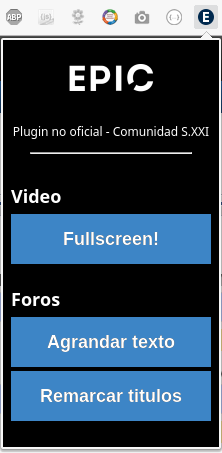

# Epic* Tweaks 

Esta extensión de Chrome posibilita:

    - ver los videos de Epic a pantalla completa. 
    - agrandar la letra de los foros.

## Como instalar

Bajar el archivo [release/epic-plugin.crx](https://github.com/libasoles/epic-plugin-sxxi/blob/master/release/epic-plugin.crx)

En Chrome, ir a Settings -> Extensions, o directamente a esta dirección: 

[chrome://extensions](chrome://extensions)

Arrastrar y soltar el archivo crx sobre la pantalla de Chrome Extensions.

## Como usar

### Videos
Es simple, haces click en el ícono del plugin, y apretas el botón "Fullscreen". Pero por supuesto, para que el plugin funcione tenes que estar en Epic y tiene que existir un video en la sección en que estas.

### Texto
En los foros, simplemente clickeas en el icono del plugin (de Chrome) y seleccionas "Agrandar texto".

## Screenshot

## No funciona?

Si ya estabas en Epic y acabas de instalar el plugin, tendrías que recargar la pagina de Epic (apretando F5).

### Videos
Si el boton "Fullscreen" no funciona, asegurate de que tu navegador de permiso al plugin para abrir una ventana emergente.

### No hay caso?
Si aún no funciona, podes dejarme un mensaje. Gracias. 

---

\* Epic es la plataforma educativa de la Univ. Siglo XXI
